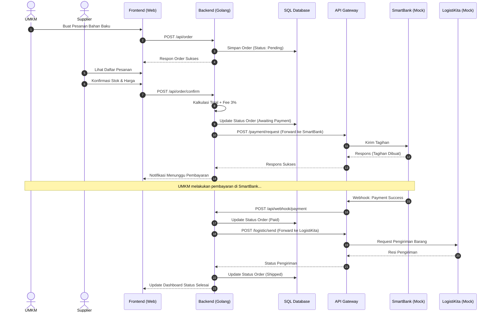
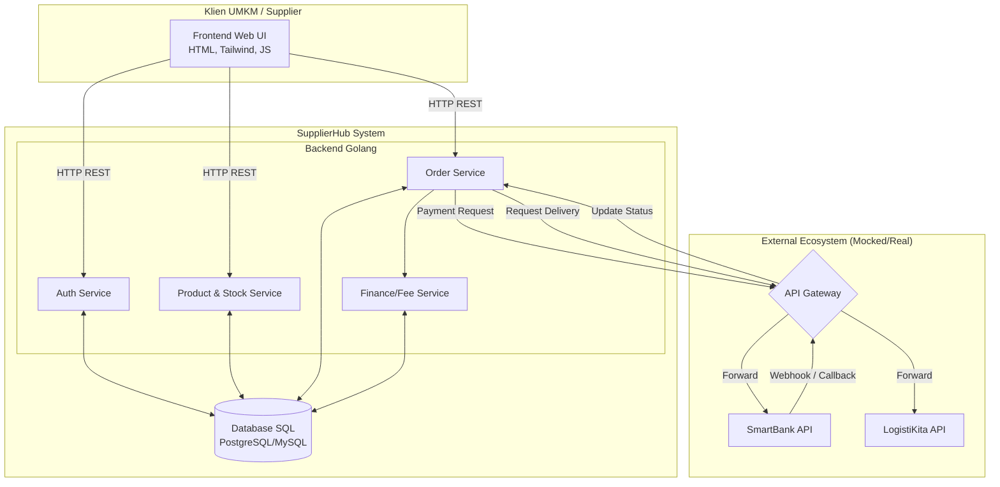

# SupplierHub - Product Requirements Document (PRD) Overview

## 1. Pendahuluan

**SupplierHub** (Kelompok 4) adalah aplikasi B2B (Business-to-Business) yang dirancang untuk menjadi jembatan ekosistem antara UMKM dan Supplier bahan baku. Aplikasi ini memfasilitasi pemesanan bahan baku oleh UMKM, manajemen stok dan harga oleh Supplier, serta terintegrasi langsung dengan ekosistem luar seperti sistem pembayaran (SmartBank) dan logistik (LogistiKita) melalui API Gateway.

Dokumentasi ini dibuat untuk merancang pengembangan aplikasi yang berpedoman pada `TugasBesar_Plan.xlsx` dengan aturan pengerjaan dan keuangan yang ketat, termasuk pemotongan _fee_ layanan sebesar 3%.

## 2. Struktur PRD (Product Requirements Document)

Sesuai dengan rencana pengembangan, dokumentasi teknis ini dibagi menjadi beberapa bagian untuk mempermudah pengerjaan secara modular:

1. **`readme.md`** (Dokumen ini) - Overview sistem, Arsitektur Makro, dan Workflow Bisnis.
2. **`prd-frontend.md`** - Spesifikasi UI/UX, routing, state management (HTML, TailwindCSS, Vanilla JS).
3. **`prd-backend.md`** - Spesifikasi arsitektur backend, Contract API, struktur Clean Code Golang, dan Database Relasional (SQL).
4. **`prd-mock-server.md`** - Spesifikasi Mock API Server untuk testing Gateway, Bank, dan Logistik (simulasi ekosistem pihak ketiga).

---

## 3. Workflow Sistem (Alur Bisnis Utama)

Skenario transaksi yang dikelola oleh SupplierHub adalah sebagai berikut:

1. **Pemesanan (UMKM):** UMKM melakukan request pemesanan bahan baku melalui UI SupplierHub.
2. **Konfirmasi (Supplier):** Supplier menerima notifikasi pesanan, lalu mengonfirmasi ketersediaan stok bahan dan menetapkan harga final pesanan.
3. **Kalkulasi Biaya:** Sistem SupplierHub menghitung total pesanan dengan menambahkan _Fee Supplier_ sebesar **3%** (aturan keuangan ekosistem).
4. **Permintaan Pembayaran:** SupplierHub mengirimkan _Payment Request_ secara terpusat ke **SmartBank** melalui **API Gateway**. Aplikasi tidak menahan saldo uang, melainkan meneruskan tagihan.
5. **Penyelesaian Transaksi:** SmartBank memproses pembayaran. Jika berhasil, SmartBank mengirimkan notifikasi status sukses ke SupplierHub (via Gateway).
6. **Pengiriman Logistik:** SupplierHub meng-update status pesanan menjadi Lunas (Paid) dan memicu panggilan API ke **LogistiKita** untuk memulai proses pengiriman dari Supplier ke UMKM.

### Diagram Workflow

---

## 4. Arsitektur Sistem

Arsitektur aplikasi akan dipisahkan menjadi komponen Frontend, Backend, dan Mock Server. Backend akan ditulis dalam Golang dengan pola _Clean Architecture_ / MVC. Aplikasi ini terhubung dengan sistem eksternal menggunakan API Gateway sebagai pintu masuk/keluar terpusat.

---

## 5. Ringkasan Teknologi

- **Frontend**: HTML5, TailwindCSS, Vanilla JavaScript (Fetch API untuk integrasi Backend).
- **Backend**: Golang (Gin/Fiber/Standar HTTP) dengan arsitektur Clean Code.
- **Database**: Relational Database menggunakan SQL (PostgreSQL atau MySQL).
- **Mock Server**: Node.js/Python/Go sederhana untuk simulasi SmartBank, LogistiKita, dan API Gateway.

---

**Status Dokumen:** ✅ Selesai
_Langkah selanjutnya adalah pembuatan **`prd-frontend.md`**, **`prd-backend.md`**, dan **`prd-mock-server.md`** sesuai alur kerja bertahap._
